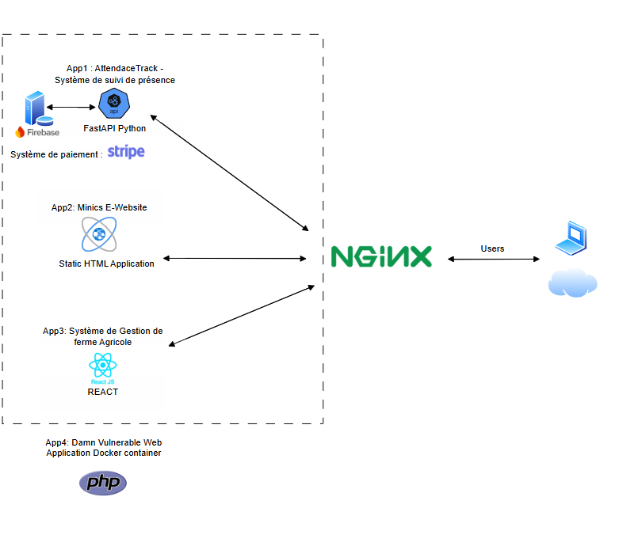

# Projet DevSecOps E5 - Déploiement Multi-Applications

## Contexte du Projet

Vous avez intégré une équipe d'ingénieur DevSecOps dans une grande entreprise française. Votre scrum master vous demande de déployer 4 applications (au choix), dont une application statique (HTML) et utiliser la passerelle de paiement Stripe, pour un nouveau client dans un environnement de développement avec Docker.

### Spécifications du Projet

**Email reçu concernant le projet avec les caractéristiques suivantes :**
- Déployer toute la stack avec une infrastructure as code avec 1 seul fichier
- Les applications doivent être le plus légères et accessibles depuis l'extérieur
- Les applications devront être accessibles derrière un reverse proxy excepté une application (au choix)
- Il faudra y accéder directement, afin de réaliser des pentests plus poussés en whitebox par une autre équipe
- Le client vous autorise à publier le code source des images des applications en open-source
- Afin de partager cela à la communauté, vous devez publier les images dans votre repository Docker Hub et les tester avec un docker compose, pour s'assurer que tout le monde puisse y accéder

### Objectifs
- Rédiger toute votre démarche, les solutions choisies ainsi qu'une image de l'infrastructure
- Présenter et expliquer la répartition des tâches de votre équipe
- Documenter l'entièreté de votre démarche et réaliser un schéma représentant l'architecture du projet
- Expliquer le choix concernant les frameworks et technologies utilisés
- Héberger tout votre travail dans un repo git, y compris les images des applications que vous optimiserez au maximum (Dockerfile) ainsi que les héberger dans une solution cloud (Docker Hub)

Ce projet démontre une configuration DevSecOps complète avec quatre applications déployées à l'aide de Docker Compose et protégées par un proxy inverse nginx.

## Partie 2: Répartition des Tâches de l'Équipe

### Répartition des Responsabilités

| **Membre** | **Tâches** |
|------------|------------|
| **Akbar KHAN** | Dockerisation et optimisation de l'application statique (app1 - Minics) |
| **Gelvy Mondestin MYSSIE BINGHA** | Dockerisation et optimisation de l'application Attendance (app3 - AttendanceTrack) |
| **Michael RAZAFIMANDIMBY** | Dockerisation et optimisation de l'application CFM (app2 - CFM Farm Management) |
| **Papa Alioune DIALLO** | Configuration du reverse-proxy et du docker-compose, infrastructure as code |
| **Piéraly Mourade STEPHANE** | Documentation, création du schéma d'architecture, coordination de la CI/CD dans l'app AttendanceTrack |

### Repositories Git et Docker Hub

#### Repositories Source Code
- **Minics E-commerce** : https://github.com/Mondestin/minics-website.git
- **CFM Farm Management** : https://github.com/Mondestin/cfm-docker-image.git
- **AttendanceTrack API** : https://github.com/Mondestin/attendance-docker.git
- **DVWA** : https://hub.docker.com/r/vulnerables/web-dvwa

#### Images Docker Hub
- **Minics** : `mondestin/minics-website:latest`
- **CFM** : `mondestin/cfm-farm-management:latest`
- **AttendanceTrack** : `mondestin/attendancetrack:latest`
- **DVWA** : `vulnerables/web-dvwa:latest`

## Vue d'Ensemble de l'Architecture

### Schéma d'Architecture du Projet



### Description Textuelle de l'Architecture

```
┌─────────────────┐    ┌─────────────────┐
│   Accès         │    │   Accès Direct  │
│   Externe       │    │   (Port 8081)   │
│   (Port 8080)   │    │                 │
└─────────┬───────┘    └─────────┬───────┘
          │                      │
          ▼                      ▼
┌─────────────────┐    ┌─────────────────┐
│  Proxy Inverse  │    │   Web DVWA      │
│     Nginx       │    │  (App-4)        │
│ internal-net    │    │ external-network│
└─────────┬───────┘    └─────────────────┘
          │
          ▼
┌─────────────────┐
│  Applications   │
│  Backend        │
│  (Protégées)    │
│ internal-net    │
│                 │
│ • Minics        │
│ • CFM           │
│ • AttendanceTrack│
└─────────────────┘
```

### Composants de l'Architecture

#### **Proxy Inverse Nginx**
- **Rôle** : Point d'entrée unique pour les applications protégées
- **Port** : 8080 (externe) → 80 (interne)
- **Réseau** : `internal-net` + `external-network`
- **Fonctionnalités** :
  - Routage des requêtes vers les applications appropriées
  - Gestion des en-têtes de sécurité
  - Compression et optimisation des performances

#### **Applications Protégées** (Réseau `internal-net`)
- **Minics E-commerce** : Site statique accessible via `/minics/`
- **CFM Farm Management** : Application React accessible via `/cfm/`
- **AttendanceTrack API** : API FastAPI accessible via `/api/`
- **Sécurité** : Isolées du réseau externe, accessibles uniquement via le proxy

#### **Application Directe** (Réseau `external-network`)
- **Web DVWA** : Application de pentesting accessible directement
- **Port** : 8081
- **Justification** : Permet les tests de sécurité en whitebox par l'équipe de pentesting

#### **Réseaux Docker**
- **`internal-net`** : Réseau sécurisé pour les applications protégées
- **`external-network`** : Réseau pour l'accès direct à DVWA

## Applications et Choix Technologiques

### Applications Protégées (Derrière le Proxy Inverse)

#### 1. **Site E-commerce Minics** (`/minics/`) - Application Statique
**Technologies choisies :**
- **HTML5/CSS3/JavaScript** : Pour un site statique performant et accessible
- **Bootstrap 4** : Framework CSS pour un design responsive moderne
- **Nginx Alpine** : Serveur web léger et sécurisé pour servir les fichiers statiques
- **Docker** : Containerisation pour une déploiement cohérent

**Justification :** Site statique ultra-léger conteneurisé dans Nginx Alpine. Utilisation de Bootstrap 4 pour un design responsive sans surcharge JavaScript. Choix d'un stack simple et efficace pour un site e-commerce statique, avec nginx pour de meilleures performances et sécurité.

**Repository :** https://github.com/Mondestin/minics-website.git

**Accès :** `http://localhost:8080/minics/`

#### 2. **Gestion de Ferme CFM** (`/cfm/`) - Application React
**Technologies choisies :**
- **React 18** : Framework moderne pour interfaces utilisateur interactives
- **TypeScript** : Typage statique pour une meilleure maintenabilité
- **Vite** : Build tool rapide pour le développement
- **Tailwind CSS** : Framework CSS utilitaire pour un design moderne
- **Radix UI** : Composants accessibles et personnalisables
- **Zustand** : Gestion d'état légère et performante

**Justification :** Front-end dynamique pour le tableau de bord de gestion de ferme. React 18 + TypeScript offrent un rendu efficace et typé. Zustand pour la gestion d'état légère, persistée en localStorage. Stack moderne pour une application de gestion complexe nécessitant une interface riche et des mises à jour en temps réel.

**Repository :** https://github.com/Mondestin/cfm-docker-image.git

**Accès :** `http://localhost:8080/cfm/`

#### 3. **API AttendanceTrack** (`/api/`) - Application FastAPI avec Stripe
**Technologies choisies :**
- **FastAPI** : Framework Python moderne et performant pour les APIs
- **Python 3.11** : Version stable et performante
- **Firebase** : Authentification et base de données cloud
- **Stripe** : Intégration de paiement sécurisée
- **PostgreSQL** : Base de données relationnelle robuste
- **SQLAlchemy** : ORM pour la gestion de base de données

**Justification :** Framework Python asynchrone performant basé sur Starlette et Pydantic. Génération automatique de la documentation OpenAPI/Swagger et validation de données intégrée. Firebase pour l'authentification sécurisée et stockage des données de sessions. Stripe pour la solution de paiement complète : API Checkout, gestion des webhooks pour suivi des paiements, conformité PCI-DSS, intégration native avec FastAPI via des SDK officiels. Stack backend robuste pour une API nécessitant authentification, paiements et gestion de données complexes.

**Repository :** https://github.com/Mondestin/attendance-docker.git

**Accès :** `http://localhost:8080/api/`

### Application à Accès Direct

#### 4. **Web DVWA** (Port 8081) - Application de Pentesting
**Technologies choisies :**
- **PHP** : Langage traditionnel pour les applications web
- **MySQL** : Base de données pour l'application DVWA
- **Apache** : Serveur web pour servir l'application

**Justification :** Application volontairement vulnérable basée sur PHP 7.x et MySQL pour le testing de vulnérabilités Web dans un environnement contrôlé. DVWA propose plusieurs niveaux de vulnérabilités (SQLi, XSS, CSRF, RCE…) pour se former dans un environnement contrôlé. Nécessite un environnement PHP traditionnel pour fonctionner correctement.

**Repository :** https://hub.docker.com/r/vulnerables/web-dvwa

**Accès :** `http://localhost:8081`

## Choix des Frameworks et Technologies

### Docker & Docker Compose
**Justification :** Conteneurisation légère pour garantir la cohérence des environnements (dev, CI, prod). Orchestration simplifiée des services via un seul fichier YAML.

### NGINX (Proxy Global)
**Justification :** Reverse-proxy dynamique détectant automatiquement les conteneurs Docker grâce aux labels, gestion automatique des certificats TLS avec Let's Encrypt, routage fine-grain des domaines.

### FastAPI & Python (AttendanceTrack)
**Justification :** Framework Python asynchrone performant basé sur Starlette et Pydantic. Génération automatique de la documentation OpenAPI/Swagger et validation de données intégrée.

### Firebase (AttendanceTrack)
**Justification :** Authentification sécurisée (Firebase Auth) et stockage des données de sessions. Gestion clé-en-main des utilisateurs et synchronisation en temps réel.

### Stripe (AttendanceTrack)
**Justification :** Solution de paiement complète : API Checkout, gestion des webhooks pour suivi des paiements, conformité PCI-DSS, intégration native avec FastAPI via des SDK officiels.

### React & Zustand (CFM)
**Justification :** Front-end dynamique pour le tableau de bord de gestion de ferme. React 18 + TypeScript offrent un rendu efficace et typé. Zustand pour la gestion d'état légère, persistée en localStorage.

### HTML/CSS/Bootstrap (Minics)
**Justification :** Site statique ultra-léger conteneurisé dans Nginx Alpine. Utilisation de Bootstrap 4 pour un design responsive sans surcharge JavaScript.

### PHP & MySQL (DVWA)
**Justification :** Application volontairement vulnérable basée sur PHP 7.x et MySQL pour le testing de vulnérabilités Web dans un environnement contrôlé.

## Détails des Applications et Infrastructure

### Minics E-commerce (Application Statique)
Un template de site e-commerce moderne et responsive construit avec HTML, CSS et JavaScript, maintenant conteneurisé avec Docker. Application ultra-légère optimisée pour les performances.

### CFM - Gestion de Ferme Avicole (Application React)
Application web complète basée sur React conçue pour la gestion de fermes avicoles. Tableau de bord moderne avec gestion des poulets, œufs, employés et finances.

### AttendanceTrack (Application FastAPI)
Application FastAPI pour la gestion de présence dans les institutions éducatives. Intégration complète avec Firebase pour l'authentification et Stripe pour les paiements.

### DVWA (Application de Pentesting)
Application PHP/MySQL destinée à l'apprentissage de la sécurité des applications Web. Elle propose plusieurs niveaux de vulnérabilités (SQLi, XSS, CSRF, RCE…) pour se former dans un environnement contrôlé.

## Construction et Déploiement des Images Docker

### Étape 1 : Construction des Images Locales

#### Application Minics (Site E-commerce)
```bash
# Naviguer vers le répertoire Minics
cd Minics

# Créer le Dockerfile
cat > Dockerfile << 'EOF'
FROM nginx:alpine
COPY . /usr/share/nginx/html/
EXPOSE 80
CMD ["nginx", "-g", "daemon off;"]
EOF

# Construire l'image
docker build -t minics-website .

# Vérifier l'image créée
docker images | grep minics-website
```

#### Application CFM (Gestion de Ferme)
```bash
# Naviguer vers le répertoire CFM
cd cfm

# Construire l'image avec le Dockerfile existant
docker build -t cfm-farm-management .

# Vérifier l'image créée
docker images | grep cfm-farm-management
```

#### Application AttendanceTrack (API)
```bash
# Naviguer vers le répertoire AttendanceTrack
cd AttendanceTrack-main

# Construire l'image avec le Dockerfile existant
docker build -t attendancetrack .

# Vérifier l'image créée
docker images | grep attendancetrack
```

### Étape 2 : Test Local des Images

#### Tester Minics
```bash
# Démarrer le conteneur Minics
docker run -d -p 8080:80 --name minics-test minics-website

# Tester l'accès
curl http://localhost:8080

# Arrêter et nettoyer
docker stop minics-test
docker rm minics-test
```

#### Tester CFM
```bash
# Démarrer le conteneur CFM
docker run -d -p 3000:3000 --name cfm-test cfm-farm-management

# Tester l'accès
curl http://localhost:3000

# Arrêter et nettoyer
docker stop cfm-test
docker rm cfm-test
```

#### Tester AttendanceTrack
```bash
# Démarrer le conteneur AttendanceTrack
docker run -d -p 8001:8001 --env-file .env --name attendancetrack-test attendancetrack

# Tester l'accès
curl http://localhost:8001/docs

# Arrêter et nettoyer
docker stop attendancetrack-test
docker rm attendancetrack-test
```

### Étape 3 : Publication sur Docker Hub

#### Préparation des Images
```bash
# Se connecter à Docker Hub
docker login

# Tagger les images pour Docker Hub (remplacer 'mondestin' par votre nom d'utilisateur)
docker tag minics-website mondestin/minics-website:latest
docker tag cfm-farm-management mondestin/cfm-farm-management:latest
docker tag attendancetrack mondestin/attendancetrack:latest
```

#### Publication des Images
```bash
# Pousser les images vers Docker Hub
docker push mondestin/minics-website:latest
docker push mondestin/cfm-farm-management:latest
docker push mondestin/attendancetrack:latest

# Vérifier les images publiées
docker search mondestin/
```

#### Images Finales sur Docker Hub
- **Minics E-commerce** : `mondestin/minics-website:latest`
- **CFM Farm Management** : `mondestin/cfm-farm-management:latest`
- **AttendanceTrack API** : `mondestin/attendancetrack:latest`
- **DVWA** : `vulnerables/web-dvwa:latest` (image officielle)

### Étape 4 : Test des Images Publiées

#### Tester depuis Docker Hub
```bash
# Supprimer les images locales
docker rmi minics-website cfm-farm-management attendancetrack

# Récupérer les images depuis Docker Hub
docker pull mondestin/minics-website:latest
docker pull mondestin/cfm-farm-management:latest
docker pull mondestin/attendancetrack:latest

# Tester chaque application
docker run -d -p 8080:80 mondestin/minics-website:latest
docker run -d -p 3000:3000 mondestin/cfm-farm-management:latest
docker run -d -p 8001:8001 --env-file .env mondestin/attendancetrack:latest

# Vérifier les conteneurs
docker ps

# Tester les accès
curl http://localhost:8080
curl http://localhost:3000
curl http://localhost:8001/docs

# Nettoyer
docker stop $(docker ps -q)
docker rm $(docker ps -aq)
```

## Construction du Docker Compose Final

### Étape 1 : Analyse des Besoins
```bash
# Identifier les ports nécessaires
netstat -tulpn | grep LISTEN

# Vérifier les images disponibles
docker images
```

### Étape 2 : Création du Docker Compose
```bash
# Créer le fichier docker-compose.yml
cat > docker-compose.yml << 'EOF'
version: '3.8'

services:
  # Nginx Reverse Proxy - Protects app-1, app-2, and app-3
  reverse-proxy:
    image: nginx:alpine
    container_name: reverse-proxy
    ports:
      - "8080:80"
    volumes:
      - ./reverse-proxy/nginx-simple.conf:/etc/nginx/nginx.conf:ro
    depends_on:
      - minics-website
      - cfm-farm-management
      - attendancetrack
    restart: unless-stopped
    networks:
      - internal-net
      - external-network

  # App-1: Minics E-commerce Website (Protected by reverse proxy)
  minics-website:
    image: mondestin/minics-website:latest
    container_name: minics-website
    expose:
      - "80"
    restart: unless-stopped
    networks:
      - internal-net

  # App-2: CFM Farm Management (Protected by reverse proxy)
  cfm-farm-management:
    image: mondestin/cfm-farm-management:latest
    container_name: cfm-farm-management
    expose:
      - "80"
    restart: unless-stopped
    networks:
      - internal-net

  # App-3: AttendanceTrack API (Protected by reverse proxy)
  attendancetrack:
    image: mondestin/attendancetrack:latest
    container_name: attendancetrack
    expose:
      - "80"
    environment:
      - FIREBASE_SERVICE_ACCOUNT_KEY=${FIREBASE_SERVICE_ACCOUNT_KEY}
      - FIREBASE_CONFIG=${FIREBASE_CONFIG}
      - STRIPE_SK=${STRIPE_SK}
      - STRIPE_WEBHOOK_SECRET=${STRIPE_WEBHOOK_SECRET}
    restart: unless-stopped
    networks:
      - internal-net

  # App-4: Web DVWA (Direct access, not protected by reverse proxy)
  web-dvwa:
    image: mondestin/web-dvwa:latest
    container_name: web-dvwa
    ports:
      - "8081:80"
    restart: unless-stopped
    networks:
      - external-network

networks:
  internal-net:
    driver: bridge
  external-network:
    driver: bridge
EOF
```

### Étape 3 : Configuration Nginx
```bash
# Créer le répertoire pour la configuration nginx
mkdir -p reverse-proxy

# Créer la configuration nginx
cat > reverse-proxy/nginx-simple.conf << 'EOF'
events {
    worker_connections 1024;
}

http {
    sendfile on;
    tcp_nopush on;
    tcp_nodelay on;
    keepalive_timeout 65;
    types_hash_max_size 2048;

    upstream minics_backend {
        server minics-website:80;
    }

    upstream cfm_backend {
        server cfm-farm-management:80;
    }

    upstream attendancetrack_backend {
        server attendancetrack:80;
    }

    server {
        listen 80;
        server_name localhost;

        location /minics/ {
            proxy_pass http://minics_backend/;
            proxy_set_header Host $host;
            proxy_set_header X-Real-IP $remote_addr;
            proxy_set_header X-Forwarded-For $proxy_add_x_forwarded_for;
            proxy_set_header X-Forwarded-Proto $scheme;
        }

        location /cfm/ {
            proxy_pass http://cfm_backend/;
            proxy_set_header Host $host;
            proxy_set_header X-Real-IP $remote_addr;
            proxy_set_header X-Forwarded-For $proxy_add_x_forwarded_for;
            proxy_set_header X-Forwarded-Proto $scheme;
        }

        location /api/ {
            proxy_pass http://attendancetrack_backend/;
            proxy_set_header Host $host;
            proxy_set_header X-Real-IP $remote_addr;
            proxy_set_header X-Forwarded-For $proxy_add_x_forwarded_for;
            proxy_set_header X-Forwarded-Proto $scheme;
        }

        location / {
            return 301 /minics/;
        }
    }
}
EOF
```

### Étape 4 : Test du Docker Compose
```bash
# Démarrer tous les services
docker-compose up -d

# Vérifier le statut
docker-compose ps

# Tester les accès
curl http://localhost:8080/health
curl http://localhost:8080/minics/
curl http://localhost:8080/cfm/
curl http://localhost:8080/api/
curl http://localhost:8081

# Voir les logs
docker-compose logs -f
```

## Difficultés Rencontrées avec les Ports

### Problème 1 : Conflit de Port 80
**Symptôme :** `Error response from daemon: Ports are not available: exposing port TCP 0.0.0.0:80 -> 0.0.0.0:0: listen tcp 0.0.0.0:80: bind: address already in use`

**Cause :** Le port 80 est souvent utilisé par :
- Services système (Apache, nginx)
- Docker Desktop
- Autres applications web

**Solution :** Utilisation du port 8080 pour le proxy inverse
```bash
# Dans docker-compose.yml
ports:
  - "8080:80"  # Au lieu de "80:80"
```

### Problème 2 : Confusion entre Ports Internes et Externes
**Symptôme :** Applications non accessibles malgré la configuration

**Cause :** Mélange entre `expose` et `ports` dans Docker

**Solution :** 
- **`expose`** : Port accessible uniquement dans le réseau Docker interne
- **`ports`** : Port mappé du conteneur vers l'hôte

```bash
# Pour les apps protégées (expose seulement)
expose:
  - "80"

# Pour l'app directe (ports pour accès externe)
ports:
  - "8081:80"
```

### Problème 3 : Configuration Nginx avec Ports Internes
**Symptôme :** Erreur de routage dans nginx

**Cause :** Configuration nginx pointant vers de mauvais ports

**Solution :** Toutes les applications utilisent le port 80 en interne
```nginx
upstream minics_backend {
    server minics-website:80;  # Port interne du conteneur
}
```

### Problème 4 : Tests de Connectivité
**Symptôme :** Difficulté à tester les applications

**Solution :** Script de test automatisé
```bash
#!/bin/bash
echo "=== Test de Connectivité ==="
curl -I http://localhost:8080/health
curl -I http://localhost:8080/minics/
curl -I http://localhost:8080/cfm/
curl -I http://localhost:8080/api/
curl -I http://localhost:8081
```

## Démarrage Rapide

### Prérequis
- Docker et Docker Compose installés
- Accès à Docker Hub pour récupérer les images

### Configuration et Déploiement
```bash
# 1. Configuration de l'environnement
cp .env.example .env
# Éditez .env avec vos clés Firebase et Stripe
# ⚠️ IMPORTANT: Ne jamais commiter le fichier .env dans Git
```

# 2. Déployer toutes les applications
docker-compose up -d

# 3. Vérifier le statut
docker-compose ps
```

### Accès aux Applications
- **Site Minics** : http://localhost:8080/minics/
- **Gestion de Ferme CFM** : http://localhost:8080/cfm/
- **API AttendanceTrack** : http://localhost:8080/api/
- **Web DVWA** : http://localhost:8081
- **Vérification de Santé** : http://localhost:8080/health

## Commandes Utiles

```bash
# Gestion des services
docker-compose up -d          # Démarrer
docker-compose down           # Arrêter
docker-compose restart [service]  # Redémarrer un service

# Logs et surveillance
docker-compose logs -f        # Voir les logs en temps réel
docker-compose ps            # Statut des conteneurs

# Mise à jour
docker-compose pull          # Récupérer les dernières images
docker-compose up -d         # Redéployer
```

## Dépannage Rapide

### Problèmes Courants
1. **Conflits de ports** : Vérifiez que les ports 8080 et 8081 sont libres
2. **Variables d'environnement** : Assurez-vous que `.env` est configuré
3. **Images Docker** : Vérifiez la connectivité Docker Hub

### Tests de Connectivité
```bash
# Test rapide de toutes les applications
curl http://localhost:8080/health
curl http://localhost:8080/minics/
curl http://localhost:8080/cfm/
curl http://localhost:8080/api/
curl http://localhost:8081
```

## Sécurité et Bonnes Pratiques

### Protection des Secrets
- **Ne jamais commiter** le fichier `.env` dans Git
- Utiliser `.env.example` comme template
- Configurer les variables d'environnement localement
- Utiliser des secrets managers en production

### Variables d'Environnement Requises
```bash
# Firebase Configuration
FIREBASE_SERVICE_ACCOUNT_KEY=your_firebase_service_account_key
FIREBASE_CONFIG=your_firebase_config

# Stripe Configuration  
STRIPE_SK=sk_test_your_stripe_secret_key
STRIPE_WEBHOOK_SECRET=whsec_your_webhook_secret
``` 